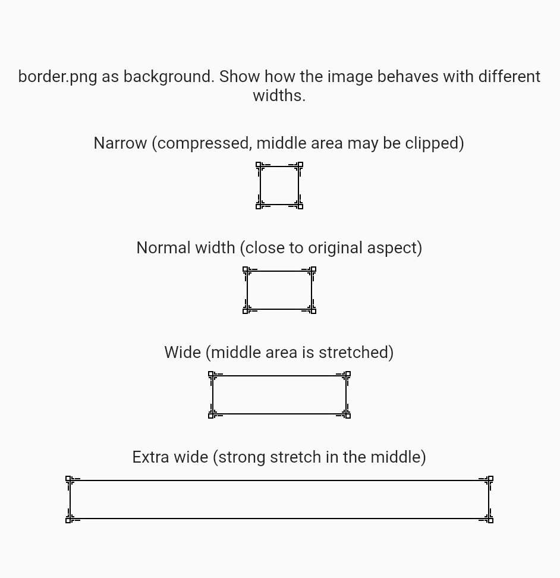

# stretchable_image
A Flutter widget that horizontally stretches the center area of an image
while keeping the left and right edges visually intact.
This is especially useful for:
- Chat bubbles
- Resizable panels / cards
- Border-like images that need to adapt to dynamic width

---
## Features
- Split image into three parts: left / center (stretch area) / right
- Only center area is stretched or cropped horizontally
- Pixel-perfect with device pixel ratio handling
- Flexible sizing:
    - Fixed size via `size`
    - Or automatically adapts to parent constraints when `size` is `null`

---
## Screenshot

Example with different target widths (using `border.png`):



---

## Installation

  Add this to your `pubspec.yaml`:


```yaml
stretchable_image: ^{latestVersion}
```
 
---
## Usage
### 1. Basic usage 
  Use fixed size if widget is bounded.
  When `size` is `null`, the widget will:
- Use `LayoutBuilder` to read parent constraints
- Fill the available width/height if bounded
- Fall back to the image’s intrinsic size if unbounded
```dart
import 'package:stretchable_image/stretchable_image.dart';

class BasicExample extends StatelessWidget {
  const BasicExample({super.key});

  @override
  Widget build(BuildContext context) {
    return const Center(
      child: StretchableImage(
        image: AssetImage('assets/border.png'),
        size: Size(200, 40),
      ),
    );
  }
}

```
  ### 2. Custom stretch area ratio
`centerStretchAreaRatio` controls how wide the stretchable center area is (relative to the whole image width).The default value is 0.5 ,and it must be less than `1.0`,
```dart
class CustomStretchAreaExample extends StatelessWidget {
  const CustomStretchAreaExample({super.key});

  @override
  Widget build(BuildContext context) {
    return Column(
      children: const [
        Text('Center stretch ratio = 0.3'),
        SizedBox(height: 8),
        StretchableImage(
          image: AssetImage('assets/border.png'),
          size: Size(200, 40),
          centerStretchAreaRatio: 0.3,
        ),
        SizedBox(height: 16),
        Text('Center stretch ratio = 0.6'),
        SizedBox(height: 8),
        StretchableImage(
          image: AssetImage('assets/border.png'),
          size: Size(200, 40),
          centerStretchAreaRatio: 0.6,
        ),
      ],
    );
  }
}
```
  ---
  ## Example from this package
  The example app (`example/lib/main.dart`) can look like this:
```dart
  import 'package:flutter/material.dart';
import 'package:stretchable_image/stretchable_image.dart';

void main() {
  runApp(const StretchableImageExampleApp());
}

class StretchableImageExampleApp extends StatelessWidget {
  const StretchableImageExampleApp({super.key});

  @override
  Widget build(BuildContext context) {
    return MaterialApp(
      title: 'StretchableImage Example',
      home: const StretchableImageDemoPage(),
      debugShowCheckedModeBanner: false,
    );
  }
}

class StretchableImageDemoPage extends StatelessWidget {
  const StretchableImageDemoPage({super.key});

  @override
  Widget build(BuildContext context) {
    const double height = 40;
    return Scaffold(
      appBar: AppBar(
        title: const Text('StretchableImage Demo'),
      ),
      body: Center(
        child: SingleChildScrollView(
          padding: const EdgeInsets.all(16),
          child: Column(
            mainAxisAlignment: MainAxisAlignment.center,
            children: const [
              Text(
                'border.png as background. '
                    'Show how the image behaves with different widths.',
                textAlign: TextAlign.center,
              ),
              SizedBox(height: 24),
              Text('Narrow (compressed, middle area may be clipped)'),
              SizedBox(height: 8),
              StretchableImage(
                image: AssetImage('assets/border.png'),
                size: Size(80, height),
              ),
              SizedBox(height: 24),
              Text('Normal width (close to original aspect)'),
              SizedBox(height: 8),
              StretchableImage(
                image: AssetImage('assets/border.png'),
                size: Size(160, height),
              ),
              SizedBox(height: 24),
              Text('Wide (middle area is stretched)'),
              SizedBox(height: 8),
              StretchableImage(
                image: AssetImage('assets/border.png'),
                size: Size(260, height),
              ),
              SizedBox(height: 24),
              Text('Extra wide (strong stretch in the middle)'),
              SizedBox(height: 8),
              StretchableImage(
                image: AssetImage('assets/border.png'),
                size: Size(360, height),
              ),
            ],
          ),
        ),
      ),
    );
  }
}
```
  ---
  ## API
```dart
  class StretchableImage extends StatefulWidget {
  /// Source image.
  final ImageProvider image;
  /// Stretch area ratio, must be less than 1.0. Default is 0.5.
  ///
  /// The image is conceptually split into three parts:
  ///   [ left | center | right ]
  /// where:
  ///   - `center` width = `centerStretchAreaRatio * imageWidth`
  ///   - `left` and `right` share the remaining width equally
  ///
  /// When the widget is stretched horizontally:
  ///   - `center` area is stretched
  ///   - `left` and `right` keep their visual shape
  ///
  /// When the widget is compressed horizontally:
  ///   - `center` area is cropped first
  ///   - `left` and `right` are preserved as much as possible
  final double centerStretchAreaRatio;
  /// Target size.
  ///
  /// - If provided, [StretchableImage] will paint with this size exactly.
  /// - If null, the widget will expand to the constraints from its parent
  ///   (using [LayoutBuilder]) and use that as the painting size.
  final Size? size;
  const StretchableImage({
  Key? key,
  required this.image,
  this.size,
  this.centerStretchAreaRatio = 0.5,
  });
  }
```
  ---

## License
 MIT License. See [LICENSE](LICENSE) for details.
